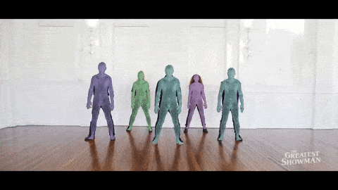
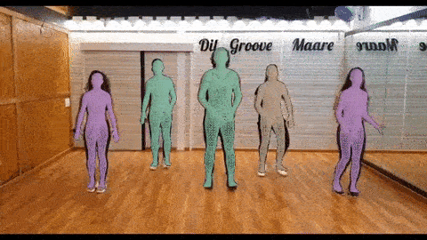
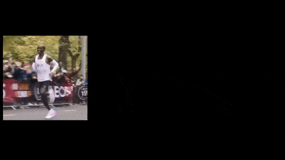
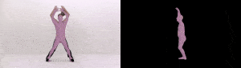

# VIBE: Video Inference for Human Body Pose and Shape Estimation [CVPR-2020]
[](https://arxiv.org/abs/1912.05656) [](https://colab.research.google.com/drive/1dFfwxZ52MN86FA6uFNypMEdFShd2euQA) [](https://paperswithcode.com/sota/3d-human-pose-estimation-on-3dpw?p=vibe-video-inference-for-human-body-pose-and)

<p float="center">
  
  
</p>

Check our YouTube videos below for more details.

| Paper Video                                                                                                | Qualitative Results                                                                                                |
|------------------------------------------------------------------------------------------------------------|--------------------------------------------------------------------------------------------------------------------|
| [](https://www.youtube.com/watch?v=rIr-nX63dUA) | [](https://www.youtube.com/watch?v=fW0sIZfQcIs) |

<!-- <sub>Sources: left video - [https://www.youtube.com/watch?v=qlPRDVqYO74](https://www.youtube.com/watch?v=qlPRDVqYO74), right video - [https://www.youtube.com/watch?v=Opry3F6aB1I](https://www.youtube.com/watch?v=Opry3F6aB1I)
</sub> -->

> [**VIBE: Video Inference for Human Body Pose and Shape Estimation**](https://arxiv.org/abs/1912.05656),            
> [Muhammed Kocabas](https://ps.is.tuebingen.mpg.de/person/mkocabas), [Nikos Athanasiou](https://ps.is.tuebingen.mpg.de/person/nathanasiou), 
[Michael J. Black](https://ps.is.tuebingen.mpg.de/person/black),        
> *IEEE Computer Vision and Pattern Recognition, 2020* 

## Features

_**V**ideo **I**nference for **B**ody Pose and Shape **E**stimation_ (VIBE) is a video pose and shape estimation method.
It predicts the parameters of SMPL body model for each frame of an input video. Pleaser refer to our [arXiv report](https://arxiv.org/abs/1912.05656) for further details.

This implementation:

- has the demo and training code for VIBE implemented purely in PyTorch,
- can work on arbitrary videos with multiple people,
- supports both CPU and GPU inference (though GPU is way faster),
- is fast, up-to 30 FPS on a RTX2080Ti (see [this table](doc/demo.md#runtime-performance)),
- achieves SOTA results on 3DPW and MPI-INF-3DHP datasets,
- includes Temporal SMPLify implementation.
- includes the training code and detailed instruction on how to train it from scratch.
- can create an FBX/glTF output to be used with major graphics softwares.

<p float="center">
  
  
</p>

## Updates

- 05/01/2021: Windows installation tutorial is added thanks to amazing [@carlosedubarreto](https://github.com/carlosedubarreto)
- 06/10/2020: Support OneEuroFilter smoothing.
- 14/09/2020: FBX/glTF conversion script is released.

## Getting Started
VIBE has been implemented and tested on Ubuntu 18.04 with python >= 3.7. It supports both GPU and CPU inference.
If you don't have a suitable device, try running our Colab demo. 

Clone the repo:
```bash
git clone https://github.com/mkocabas/VIBE.git
```

Install the requirements using `virtualenv` or `conda`:
```bash
# pip
source scripts/install_pip.sh

# conda
source scripts/install_conda.sh
```

## Running the Demo

We have prepared a nice demo code to run VIBE on arbitrary videos. 
First, you need download the required data(i.e our trained model and SMPL model parameters). To do this you can just run:

```bash
source scripts/prepare_data.sh
```

Then, running the demo is as simple as:

```bash
# Run on a local video
python demo.py --vid_file sample_video.mp4 --output_folder output/ --display

# Run on a YouTube video
python demo.py --vid_file https://www.youtube.com/watch?v=wPZP8Bwxplo --output_folder output/ --display
```

Refer to [`doc/demo.md`](doc/demo.md) for more details about the demo code.

Sample demo output with the `--sideview` flag:

<p float="left">
  
</p>

### FBX and glTF output (New Feature!)
We provide a script to convert VIBE output to standalone FBX/glTF files to be used in 3D graphics tools like
Blender, Unity etc. You need to follow steps below to be able to run the conversion script.

- You need to download FBX files for SMPL body model
    - Go to [SMPL website](https://smpl.is.tue.mpg.de/) and create an account.
    - Download the Unity-compatible FBX file through the [link](https://psfiles.is.tuebingen.mpg.de/downloads/smpl/SMPL_unity_v-1-0-0-zip)
    - Unzip the contents and locate them `data/SMPL_unity_v.1.0.0`.
- Install Blender python API
    - Note that we tested our script with Blender v2.8.0 and v2.8.3.
- Run the command below to convert VIBE output to FBX:
```
python lib/utils/fbx_output.py \
    --input output/sample_video/vibe_output.pkl \
    --output output/sample_video/fbx_output.fbx \ # specify the file extension as *.glb for glTF
    --fps_source 30 \
    --fps_target 30 \
    --gender <male or female> \
    --person_id <tracklet id from VIBE output>

``` 
### Windows Installation Tutorial

You can follow the instructions provided by [@carlosedubarreto](https://github.com/carlosedubarreto) to install and run VIBE on a Windows machine:

- VIBE windows installation tutorial: https://youtu.be/3qhs5IRJ1LI
- FBX conversion: https://youtu.be/w1biKeiQThY
- Helper github repo: https://github.com/carlosedubarreto/vibe_win_install

## Google Colab
If you do not have a suitable environment to run this project then you could give Google Colab a try. 
It allows you to run the project in the cloud, free of charge. You may try our Colab demo using the notebook we have prepared: 
[](https://colab.research.google.com/drive/1dFfwxZ52MN86FA6uFNypMEdFShd2euQA)


## Training
Run the commands below to start training:

```shell script
source scripts/prepare_training_data.sh
python train.py --cfg configs/config.yaml
```

Note that the training datasets should be downloaded and prepared before running data processing script.
Please see [`doc/train.md`](doc/train.md) for details on how to prepare them.
 
## Evaluation

Here we compare VIBE with recent state-of-the-art methods on 3D pose estimation datasets. Evaluation metric is
Procrustes Aligned Mean Per Joint Position Error (PA-MPJPE) in mm.

| Models         | 3DPW &#8595; | MPI-INF-3DHP &#8595; | H36M &#8595; |
|----------------|:----:|:------------:|:----:|
| SPIN           | 59.2 |     67.5     | **41.1** |
| Temporal HMR   | 76.7 |     89.8     | 56.8 |
| VIBE           | 56.5 |     **63.4**     | 41.5 |

See [`doc/eval.md`](doc/eval.md) to reproduce the results in this table or 
evaluate a pretrained model.

**Correction**: Due to a mistake in dataset preprocessing, VIBE trained with 3DPW results in Table 1 of the original paper are not correct.
Besides, even though training with 3DPW guarantees better quantitative performance, it does not give good 
qualitative results. ArXiv version will be updated with the corrected results. 

## Citation

```bibtex
@inproceedings{kocabas2019vibe,
  title={VIBE: Video Inference for Human Body Pose and Shape Estimation},
  author={Kocabas, Muhammed and Athanasiou, Nikos and Black, Michael J.},
  booktitle = {The IEEE Conference on Computer Vision and Pattern Recognition (CVPR)},
  month = {June},
  year = {2020}
}
```

## License
This code is available for **non-commercial scientific research purposes** as defined in the [LICENSE file](LICENSE). By downloading and using this code you agree to the terms in the [LICENSE](LICENSE). Third-party datasets and software are subject to their respective licenses.


## References
We indicate if a function or script is borrowed externally inside each file. Here are some great resources we 
benefit:

- Pretrained HMR and some functions are borrowed from [SPIN](https://github.com/nkolot/SPIN).
- SMPL models and layer is from [SMPL-X model](https://github.com/vchoutas/smplx).
- Some functions are borrowed from [Temporal HMR](https://github.com/akanazawa/human_dynamics).
- Some functions are borrowed from [HMR-pytorch](https://github.com/MandyMo/pytorch_HMR).
- Some functions are borrowed from [Kornia](https://github.com/kornia/kornia).
- Pose tracker is from [STAF](https://github.com/soulslicer/openpose/tree/staf).

